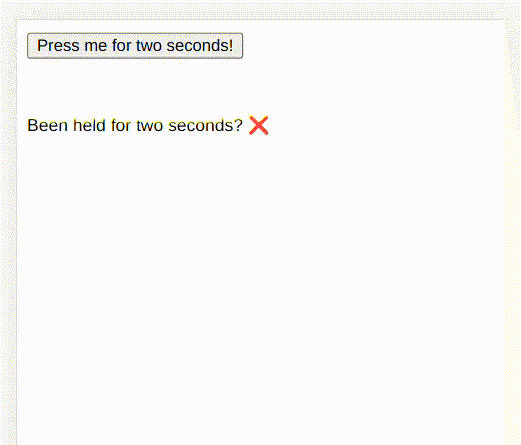

#### What it does? 

- runs a callback function after touching and holding the component for specific milliseconds. it only fires the "holding" callback on touch screens.



#### Props list 
| Name      | Type | Description |
| - | - | -
| tag      | string | wrapper element for the component
| delay   | number | number of milliseconds needed to hold the component before triggering the callback
| onHold | function | runs this function after pressing the component for specific milliseconds
| onClick | function | Just a simple onClick event. Unless onHold, You can run this with clicking with the mouse

#### How to use?
```javascript
<script>
    import TouchHold from 'svelte-touch-hold'
    
    const callback = () => {
	alert('Do something fancy!!!')
     }	
</script>

<TouchHold tag='button' delay={2000} onHold={callback}>
    Hello world 
</TouchHold>
```

